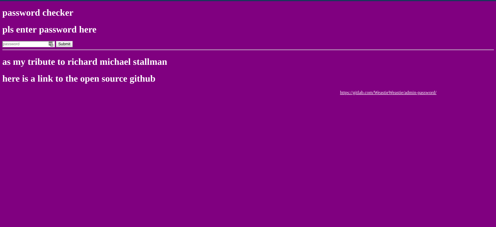
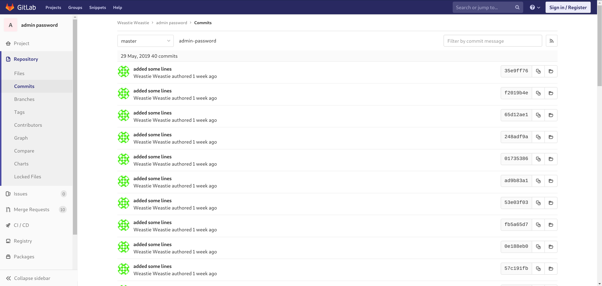
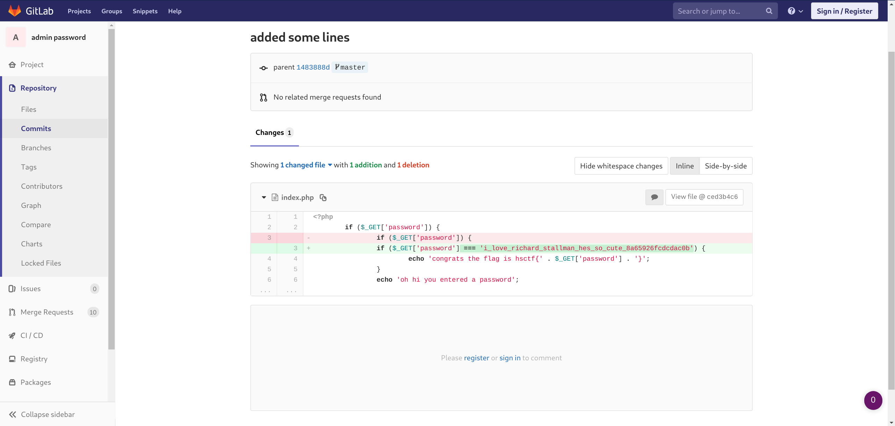

Admin Pass

# Description

Hey guys, found a super cool website at http://misc.hsctf.com:8001!

Edit: If the site is blocked by school filters, try

http://misc.hsctf.com or http://misc.hsctf.com:8080; both will work!

# Solution

Going to the website we are given a password field, and a link to a gitlab page. Going to the gitlab page, we are given a description of the project, but nothing that could be useful to us as of yet. Gitlab is a version control service, so given that we have access to previous versions of the website it might be a good idea to check out the commits and see what's there. 

There seems like a lot of commits with descriptions that aren't super telling of what they contain. Using brute force and just going through all of the commits we eventually come across one interesting one. 

It seems that there is a comparsion check with something that looks exaclty like a ctf flag. Inputting it back in to the password checker website, tells us that we've got the correct flag. 
